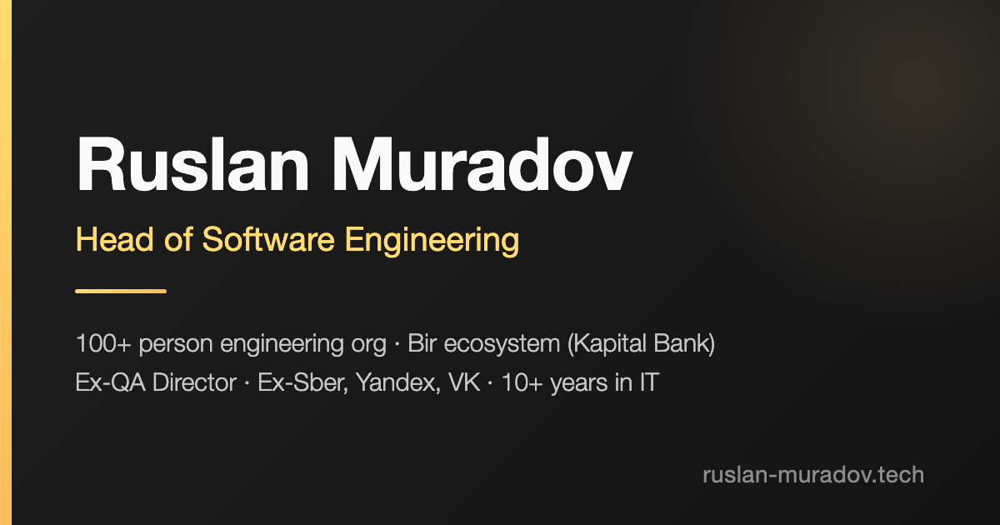

<div align="center">

# [ruslan-muradov.tech](https://ruslan-muradov.tech)

**Personal site of Ruslan Muradov** — Engineering Leader · Head of Software Engineering @ Bir ecosystem

[](https://ruslan-muradov.tech)


[](https://ruslan-muradov.tech)

</div>

## Highlights

- **Single page, four tabs** — About / Resume / Blog / Contact with hash deep links (`/#resume`)
- **Interactive competency radar** — pure SVG + vanilla JS, labelled maturity rings (Familiar → Expert), keyboard-accessible
- **Zero dependencies, zero build** — no frameworks, no bundler; ~0.4 MB total page weight
- **SEO-ready** — `ProfilePage` JSON-LD, Open Graph cover, sitemap, robots, canonical
- **Live local time** — sidebar clock pinned to Baku (GMT+4)

## Structure

```
index.html            single-page site
thanks.html           contact-form success page
assets/css/style.css  all styles (dark theme, no preprocessor)
assets/js/script.js   navigation, project modal, radar chart, clock
assets/images/        logos, avatar, OG cover
robots.txt, sitemap.xml, CNAME
```

## Local development

```bash
python3 -m http.server 8005
```

Open http://localhost:8005 — that's it. Deployment is just a push to `main`;
GitHub Pages serves the site as-is at [ruslan-muradov.tech](https://ruslan-muradov.tech).

## Contact

[LinkedIn](https://www.linkedin.com/in/ruslan-m/) · [Medium](https://medium.com/@unrus.tech) · [HackerNoon](https://hackernoon.com/u/unrus) · muradov.work@gmail.com
